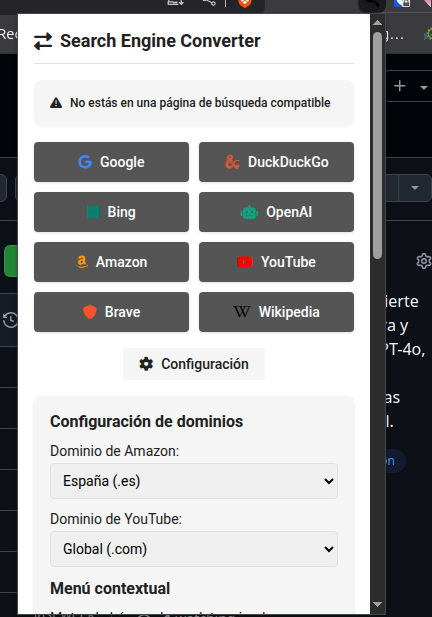
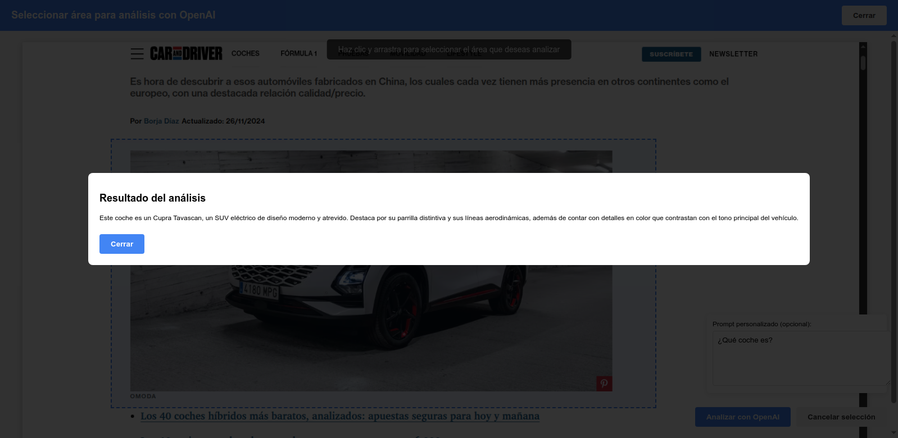

<div align="center">

# Search Engine Converter para Firefox


### Motores de búsqueda soportados:

[](https://www.google.com) &nbsp;&nbsp;
[](https://www.bing.com) &nbsp;&nbsp;
[](https://duckduckgo.com) &nbsp;&nbsp;
[](https://chat.openai.com) &nbsp;&nbsp;
[](https://www.amazon.es) &nbsp;&nbsp;
[](https://www.youtube.com) &nbsp;&nbsp;
[](https://es.wikipedia.org)

_Convierte tus búsquedas entre Google, Brave, DuckDuckGo, Bing, OpenAI, Amazon, YouTube y Wikipedia con un solo clic o desde el menú contextual. Captura y analiza imágenes con OpenAI._

[](https://github.com/686f6c61/extension-chrome-search-engine-converter)
[](https://github.com/686f6c61/extension-chrome-search-engine-converter)

</div>

## 📝 Descripción

**Search Engine Converter** es una extensión minimalista para Chrome/Brave que te permite cambiar fácilmente entre resultados de búsqueda de diferentes motores de búsqueda compatibles (Google, Brave, DuckDuckGo, Bing, OpenAI, Amazon y YouTube). Con un simple clic, la extensión redirige la página de resultados del motor de búsqueda actual a la página correspondiente del motor de búsqueda seleccionado, conservando exactamente los mismos términos de búsqueda.

## ✨ Características

- Funciona con múltiples motores de búsqueda compatibles: Google, Brave, DuckDuckGo, Bing, OpenAI, Amazon, YouTube y Wikipedia
- Interfaz minimalista con iconos claramente identificables
- Cambio instantáneo entre motores de búsqueda con un solo clic
- Menú contextual para buscar texto seleccionado en cualquier página
- Opción para configurar el motor de búsqueda predeterminado para el menú contextual
- Configuración personalizable para dominios de Amazon y YouTube
- 🔄 Conversión instantánea de Brave Search a múltiples motores de búsqueda
- 🔍 Mantiene los términos de búsqueda originales
- 🎨 Interfaz minimalista con colores distintivos para cada motor de búsqueda
- 📱 Diseño moderno y responsive
- 🔔 Feedback visual con indicadores de estado
- ⚡ Ligera y rápida, sin impacto en el rendimiento
- 🔐 Búsqueda rápida con motor predeterminado configurable
- 📸 Captura de áreas específicas de la pantalla para análisis con OpenAI
- 🤖 Integración con el modelo GPT-4o-mini para análisis de imágenes

## 📷 Capturas de pantalla

### Popup de la extensión



### Menú contextual


### Captura y análisis con OpenAI



#### Popup de la extensión:
- Panel principal con el título "Search Engine Converter"
- Indicador de estado que muestra el motor de búsqueda detectado
- Botones para convertir la búsqueda a Google, DuckDuckGo, Bing, OpenAI, Amazon y YouTube
- Panel de configuración para personalizar dominios regionales y orden de botones
- Información de versión y enlace al repositorio

#### Menú contextual:
- Opción de búsqueda rápida con el motor predeterminado
- Submenú para buscar en cualquiera de los motores disponibles
- Posibilidad de establecer el motor de búsqueda predeterminado
- Funciona en cualquier página web con texto seleccionado
- Opción para capturar y analizar áreas de la pantalla con OpenAI

#### Captura y análisis con OpenAI:
- Captura de pantalla completa con un solo clic desde el menú contextual
- Interfaz dedicada para seleccionar con precisión el área a analizar
- Análisis de imágenes utilizando modelos avanzados de OpenAI
- Resultados detallados presentados en una interfaz clara y legible
- Configuración personalizable de API key, modelo y límite de tokens
- Soporte para múltiples modelos de OpenAI:
  - GPT-4o-mini (recomendado): Equilibrio entre rendimiento y velocidad
  - GPT-4o: Mayor capacidad de análisis y detalle
  - GPT-3.5 Turbo: Opción más rápida y económica
- Posibilidad de añadir prompts personalizados para dirigir el análisis de la imagen

## 🚀 Instalación

### Instalación temporal (Modo desarrollador)

1. Descarga o clona este repositorio
   ```bash
   git clone https://github.com/686f6c61/extension-chrome-search-engine-converter.git
   ```

2. Abre Firefox y navega a `about:debugging#/runtime/this-firefox`

3. Haz clic en "Cargar complemento temporal..."

4. Selecciona el archivo `manifest.json` dentro de la carpeta Firefox del repositorio

5. ¡Listo! La extensión aparecerá en tu barra de herramientas

**Nota**: Las extensiones temporales se eliminan cuando cierras Firefox. Para una instalación permanente, la extensión debe estar firmada por Mozilla.

## 🔧 Uso

### Desde el popup de la extensión

1. Navega a una página de resultados de búsqueda de Brave (URL que comience con `https://search.brave.com/search?`)

2. Haz clic en el icono de la extensión en la barra de herramientas

3. Verás un mensaje preguntando a qué motor de búsqueda deseas cambiar

4. Si estás en una página de búsqueda de Brave, selecciona uno de los motores disponibles:
   - Google: Para buscar en Google Search
   - DuckDuckGo: Para buscar en DuckDuckGo
   - Bing: Para buscar en Microsoft Bing
   - OpenAI: Para preguntar a ChatGPT
   - Amazon: Para buscar productos en Amazon
   - YouTube: Para buscar videos en YouTube

5. La página se actualizará automáticamente con los resultados equivalentes en el motor seleccionado

### Desde el menú contextual (botón derecho)

1. Selecciona cualquier texto en cualquier página web

2. Haz clic derecho sobre el texto seleccionado

3. En el menú contextual, encontrarás las siguientes opciones:
   - "Búsqueda rápida en [Motor predeterminado]": Busca directamente con tu motor preferido
   - "Buscar '[texto seleccionado]' en...": Submenu con todos los motores disponibles
   - "Establecer motor predeterminado": Para cambiar el motor de búsqueda rápida

4. Al seleccionar cualquier opción, se abrirá una nueva pestaña con los resultados de la búsqueda

### Captura y análisis de pantalla con OpenAI

1. Haz clic derecho en cualquier parte de una página web

2. Selecciona "Capturar y analizar con OpenAI" en el menú contextual

3. Se capturará automáticamente la pantalla visible y se abrirá una nueva pestaña

4. En la nueva pestaña, haz clic y arrastra para seleccionar el área específica que deseas analizar

5. Opcionalmente, escribe un prompt personalizado en el campo de texto para dirigir el análisis (por ejemplo, "Identifica los productos que aparecen en esta imagen")

6. Haz clic en el botón "Analizar con OpenAI" para procesar la imagen seleccionada

7. Espera unos segundos mientras se procesa la imagen y se muestra el resultado del análisis

8. Puedes cerrar la ventana de resultados o la pestaña completa cuando hayas terminado

### Personalización

1. Haz clic en el botón "Configuración" en el popup de la extensión

2. Puedes configurar:
   - Dominios regionales para Amazon y YouTube
   - Clave API de OpenAI para el análisis de imágenes
   - Modelo de OpenAI a utilizar (gpt-4o-mini por defecto)
   - Límite de tokens para las respuestas de OpenAI (ajustable entre 100 y 4000)
   - Motor de búsqueda predeterminado para el menú contextual
   - Orden de los botones mediante arrastrar y soltar

3. Haz clic en "Guardar" para aplicar los cambios

## 🤖 Modelos de OpenAI soportados

La extensión soporta los siguientes modelos de OpenAI para el análisis de imágenes:

| Modelo | Descripción | Caso de uso recomendado |
|--------|-------------|------------------------|
| GPT-4o-mini | Versión más ligera de GPT-4o | Uso general, buen equilibrio entre rendimiento y velocidad |
| GPT-4o | Modelo más potente con capacidades multimodales | Análisis detallado de imágenes complejas |
| GPT-3.5 Turbo | Modelo más rápido y económico | Análisis básico de imágenes sencillas |

Para más información sobre las capacidades y características de cada modelo, visita la [documentación oficial de OpenAI](https://platform.openai.com/docs/models).

## ⚠️ Limitaciones

- La funcionalidad de conversión de búsquedas solo funciona en páginas de resultados de búsqueda de Brave
- Requiere una conexión a internet activa para redirigir a los motores de búsqueda
- Para OpenAI, es posible que necesites estar logueado o tener una cuenta para acceder a ChatGPT
- La funcionalidad de captura y análisis requiere una clave API válida de OpenAI
- El uso de la API de OpenAI puede generar costos según su política de precios
- No recopila ni almacena datos de búsqueda o imágenes capturadas

## 👥 Contribuciones

Las contribuciones son bienvenidas. Si deseas mejorar esta extensión:

1. Haz un fork del repositorio
2. Crea una rama para tu característica (`git checkout -b feature/nueva-caracteristica`)
3. Haz commit de tus cambios (`git commit -m 'Añade nueva característica'`)
4. Haz push a la rama (`git push origin feature/nueva-caracteristica`)
5. Abre un Pull Request

## 📄 Licencia

Distribuido bajo la Licencia MIT. Ver `LICENSE` para más información.

## 📧 Contacto

Puedes encontrarme en GitHub: [@686f6c61](https://github.com/686f6c61)

---

<div align="center">

_Desarrollado con ❤️ para la comunidad_

</div>
