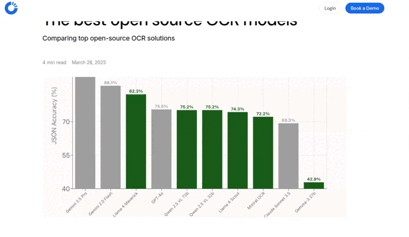
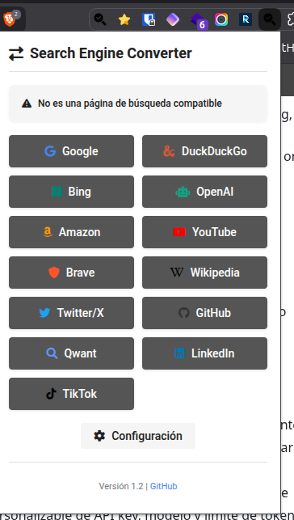
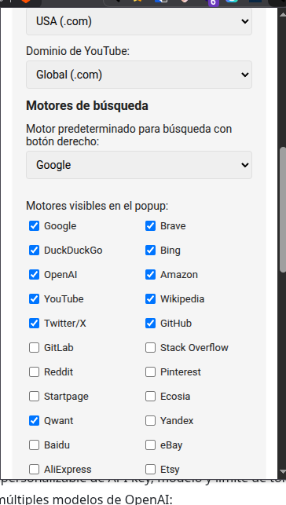
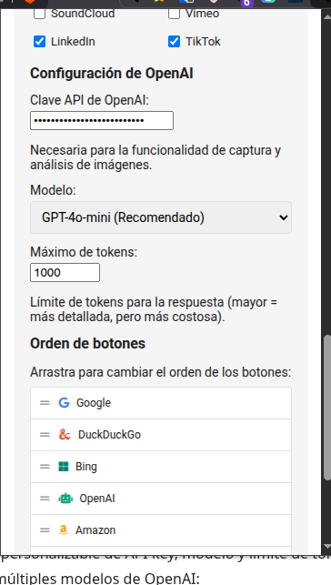

<div align="center">

# Search Engine Converter

### 30 Motores de búsqueda soportados:

#### Motores de búsqueda principales:
[](https://www.google.com) &nbsp;&nbsp;
[](https://duckduckgo.com) &nbsp;&nbsp;
[](https://www.bing.com) &nbsp;&nbsp;
[](https://search.brave.com) &nbsp;&nbsp;
[](https://www.startpage.com) &nbsp;&nbsp;
[](https://www.ecosia.org) &nbsp;&nbsp;
[](https://www.qwant.com) &nbsp;&nbsp;
[](https://yandex.com) &nbsp;&nbsp;
[](https://www.baidu.com)

#### Redes sociales y contenido:
[](https://www.youtube.com) &nbsp;&nbsp;
[](https://twitter.com) &nbsp;&nbsp;
[](https://www.reddit.com) &nbsp;&nbsp;
[](https://www.pinterest.com) &nbsp;&nbsp;
[](https://www.linkedin.com) &nbsp;&nbsp;
[](https://www.tiktok.com) &nbsp;&nbsp;
[](https://vimeo.com) &nbsp;&nbsp;
[](https://soundcloud.com) &nbsp;&nbsp;
[](https://open.spotify.com)

#### Comercio electrónico:
[](https://www.amazon.com) &nbsp;&nbsp;
[](https://www.ebay.com) &nbsp;&nbsp;
[](https://www.aliexpress.com) &nbsp;&nbsp;
[](https://www.etsy.com)

#### Desarrollo y conocimiento:
[](https://github.com) &nbsp;&nbsp;
[](https://gitlab.com) &nbsp;&nbsp;
[](https://stackoverflow.com) &nbsp;&nbsp;
[](https://wikipedia.org) &nbsp;&nbsp;
[](https://scholar.google.com) &nbsp;&nbsp;
[](https://archive.org) &nbsp;&nbsp;
[WolframAlpha](https://www.wolframalpha.com)

#### IA y Chat:
[](https://chat.openai.com)

_Convierte tus búsquedas entre Google, Brave, DuckDuckGo, Bing, OpenAI, Amazon, YouTube y Wikipedia con un solo clic o desde el menú contextual. Captura y analiza áreas específicas de la pantalla con OpenAI._

[](https://github.com/686f6c61/extension-chrome-search-engine-converter)
[](https://github.com/686f6c61/extension-chrome-search-engine-converter)
[](https://github.com/686f6c61/extension-chrome-search-engine-converter)
[](https://github.com/686f6c61/extension-chrome-search-engine-converter)
[](https://github.com/686f6c61/extension-chrome-search-engine-converter)

</div>

## 📝 Descripción

**Search Engine Converter** es una extensión completa y versátil que revoluciona la forma en que interactúas con los motores de búsqueda y el contenido web. Ofrece dos funcionalidades principales:

1. **Conversión entre motores de búsqueda**: Cambia instantáneamente entre diferentes motores de búsqueda (Google, Brave, DuckDuckGo, Bing, OpenAI, Amazon, YouTube y Wikipedia) manteniendo exactamente los mismos términos de búsqueda. Con un solo clic, la extensión redirige la página de resultados actual a la página correspondiente del motor de búsqueda seleccionado.

2. **Análisis de contenido con OpenAI**: Captura áreas específicas de cualquier página web para analizarlo utilizando los potentes modelos de inteligencia artificial de OpenAI. Esta funcionalidad te permite obtener análisis detallados, explicaciones, traducciones o cualquier otro tipo de procesamiento de imágenes directamente desde tu navegador. Los resultados se muestran en texto plano sin formato markdown para mejor legibilidad.



## 💲 Estructura del Repositorio

Este repositorio contiene versiones de la extensión para diferentes navegadores, cada una adaptada a las especificaciones y APIs particulares de cada plataforma:

- **Chrome-Brave-Edge/**: Versión compatible con navegadores basados en Chromium (Google Chrome, Microsoft Edge, Brave)
  - Utiliza Manifest V3, el estándar más reciente para extensiones de Chrome
  - Optimizada para el rendimiento en navegadores Chromium
  - Incluye todas las funcionalidades de conversión y análisis con OpenAI

- **Firefox/**: Versión adaptada específicamente para Mozilla Firefox
  - Implementa el polyfill de WebExtension para compatibilidad entre navegadores
  - Adaptada a las APIs específicas de Firefox para capturas de pantalla y menús contextuales
  - Incluye las mismas funcionalidades que la versión de Chrome, con optimizaciones para Firefox

## ✨ Características

### Conversión entre motores de búsqueda

- **Compatibilidad extensa**: Funciona con los principales motores de búsqueda: Google, Brave, DuckDuckGo, Bing, OpenAI, Amazon, YouTube y Wikipedia
- **Conversión instantánea**: Cambia entre motores de búsqueda con un solo clic, manteniendo exactamente los mismos términos de búsqueda
- **Menú contextual inteligente**: Busca cualquier texto seleccionado en el motor de búsqueda que prefieras directamente desde el menú contextual
- **Configuración personalizable**: Adapta la extensión a tus necesidades con opciones para dominios regionales de Amazon y YouTube
- **Motor predeterminado configurable**: Establece tu motor de búsqueda favorito como predeterminado para búsquedas rápidas

### Análisis con OpenAI (NUEVO v1.2)

- **Captura y análisis de áreas específicas**: Selecciona con precisión cualquier parte de una página web para analizarla con OpenAI
- **Interfaz mejorada**: Panel integrado directamente en la página sin abrir nuevas pestañas
- **Prompts personalizados**: Dirige el análisis con instrucciones específicas (ej: "Traduce esto", "Explica el gráfico")
- **Resultados en texto plano**: Sin formato markdown para mejor legibilidad y facilidad de copia
- **Modelos avanzados**: Compatibilidad con los últimos modelos de OpenAI (GPT-4o-mini, GPT-4o, GPT-3.5 Turbo)
- **Configuración flexible**: Personaliza la API key, modelo y parámetros para adaptarse a tus necesidades

### Diseño y experiencia de usuario

- **Interfaz minimalista**: Diseño limpio con iconos claramente identificables para cada motor de búsqueda
- **Feedback visual**: Indicadores de estado que muestran el motor de búsqueda detectado y el progreso de las operaciones
- **Alto rendimiento**: Extensión ligera y rápida, optimizada para no afectar el rendimiento del navegador
- **Diseño responsive**: Adaptable a diferentes tamaños de pantalla y resoluciones
- **Temas personalizables**: Soporte para tema claro, oscuro o sincronizado con el sistema

## 🔒 Seguridad

Esta extensión implementa múltiples capas de seguridad para proteger tus datos y garantizar una experiencia segura:

### Cifrado de datos sensibles
- **Cifrado AES-GCM**: Todas las API keys se cifran usando el algoritmo AES-GCM de 256 bits antes de almacenarse
- **Derivación de claves segura**: Utiliza PBKDF2 con 100,000 iteraciones para generar claves de cifrado robustas
- **Contraseña única**: Cada instalación genera una contraseña única basada en el ID de la extensión y el user agent
- **Web Crypto API**: Implementación usando las APIs criptográficas nativas del navegador para máxima seguridad

### Sanitización de contenido
- **Prevención de XSS**: Todas las respuestas de OpenAI se sanitizan antes de mostrarse en el DOM
- **Escape de HTML**: Los caracteres especiales se escapan correctamente para prevenir inyección de código
- **Conversión segura de Markdown**: El contenido Markdown se convierte a HTML seguro con etiquetas permitidas
- **Lista blanca de etiquetas**: Solo se permiten etiquetas HTML seguras (p, br, strong, em, code, pre, ul, ol, li, blockquote, h1-h6, a)

### Recursos locales
- **Sin dependencias CDN**: html2canvas se carga localmente, eliminando riesgos de seguridad de terceros
- **Integridad verificada**: Todos los recursos locales están incluidos en el paquete de la extensión
- **Control total**: No hay llamadas a servidores externos excepto a api.openai.com

### Content Security Policy (CSP)
- **Scripts restringidos**: Solo se permite la ejecución de scripts propios de la extensión (`script-src 'self'`)
- **Sin objetos externos**: Política `object-src 'none'` para prevenir la carga de plugins
- **Conexiones limitadas**: Solo se permiten conexiones a api.openai.com y recursos esenciales
- **Protección contra inyección**: La CSP previene la ejecución de scripts inline no autorizados

### Rate Limiting
- **Control de uso**: Límite de 10 solicitudes por minuto a la API de OpenAI
- **Protección contra abuso**: Bloqueo temporal de 5 minutos si se excede el límite
- **Ahorro de costos**: Previene el uso excesivo accidental de la API
- **Retroalimentación clara**: Mensajes informativos sobre el estado del límite de tasa

### Permisos mínimos
- La extensión solo solicita los permisos estrictamente necesarios
- No se recopilan ni envían datos a servidores externos (excepto OpenAI cuando se usa esa función)
- Las API keys nunca se transmiten a ningún servidor que no sea api.openai.com

## 🖼️ Capturas de pantalla

### Extensión en acción


### Interfaz principal



### Configuración y opciones



### Análisis con OpenAI



#### Popup de la extensión:
- Panel principal con el título "Search Engine Converter"
- Indicador de estado que muestra el motor de búsqueda detectado
- Botones para convertir la búsqueda a Google, DuckDuckGo, Bing, OpenAI, Amazon y YouTube
- Panel de configuración para personalizar dominios regionales y orden de botones
- Información de versión y enlace al repositorio

#### Menú contextual:
- Opción de búsqueda rápida con el motor predeterminado
- Submenú para buscar en cualquiera de los motores disponibles
- Posibilidad de establecer el motor de búsqueda predeterminado
- Funciona en cualquier página web con texto seleccionado
- Opción para capturar y analizar áreas de la pantalla con OpenAI

#### Captura y análisis con OpenAI:
- Captura de pantalla completa con un solo clic desde el menú contextual
- Interfaz dedicada para seleccionar con precisión el área a analizar
- Análisis de imágenes utilizando modelos avanzados de OpenAI
- Resultados detallados presentados en una interfaz clara y legible
- Configuración personalizable de API key, modelo y límite de tokens
- Soporte para múltiples modelos de OpenAI:
  - GPT-4o-mini (recomendado): Equilibrio entre rendimiento y velocidad
  - GPT-4o: Mayor capacidad de análisis y detalle
- Posibilidad de añadir prompts personalizados para dirigir el análisis de la imagen

## 🚀 Instalación

### Para Chrome, Brave o Edge

#### Instalación manual (Modo desarrollador)

1. **Descarga o clona este repositorio**
   ```bash
   git clone https://github.com/686f6c61/extension-chrome-search-engine-converter.git
   ```

2. **Accede al gestor de extensiones**
   - En Chrome: Navega a `chrome://extensions/`
   - En Brave: Navega a `brave://extensions/`
   - En Edge: Navega a `edge://extensions/`

3. **Activa el "Modo de desarrollador"**
   - Busca el interruptor en la esquina superior derecha y actívalo
   - Esto permite instalar extensiones no verificadas desde fuentes locales

4. **Instala la extensión**
   - Haz clic en "Cargar descomprimida" (o "Cargar sin empaquetar")
   - Navega hasta la carpeta del repositorio clonado
   - Selecciona la carpeta `Chrome-Brave-Edge` que contiene los archivos de la extensión

5. **Verifica la instalación**
   - La extensión aparecerá en la lista de extensiones instaladas
   - El icono de Search Engine Converter se mostrará en la barra de herramientas
   - Puedes fijar el icono haciendo clic en el menú de extensiones y seleccionando el icono de pin junto a Search Engine Converter

### Para Firefox

#### Instalación temporal (Modo desarrollador)

1. **Descarga o clona este repositorio**
   ```bash
   git clone https://github.com/686f6c61/extension-chrome-search-engine-converter.git
   ```

2. **Accede al depurador de Firefox**
   - Abre Firefox y navega a `about:debugging#/runtime/this-firefox`
   - Esta página te permite cargar extensiones temporales para pruebas

3. **Carga la extensión**
   - Haz clic en "Cargar complemento temporal..."
   - Navega hasta la carpeta del repositorio clonado
   - Selecciona el archivo `manifest.json` dentro de la carpeta `Firefox`

4. **Verifica los permisos**
   - Firefox te mostrará los permisos que la extensión necesita
   - Asegúrate de conceder todos los permisos necesarios para el funcionamiento correcto

5. **Usa la extensión**
   - El icono de Search Engine Converter aparecerá en la barra de herramientas
   - La extensión está lista para usar

**Nota importante**: Las extensiones temporales en Firefox se eliminan cuando cierras el navegador. Para una instalación permanente, la extensión debe estar firmada por Mozilla a través de su proceso de verificación.

## 🔧 Uso

### Conversión entre motores de búsqueda

#### Desde el popup de la extensión

1. **Navega a una página de resultados de búsqueda**
   - La extensión funciona en cualquier página de resultados de Google, Brave, DuckDuckGo, Bing, etc.
   - El icono de la extensión mostrará el motor de búsqueda detectado

2. **Abre el popup de la extensión**
   - Haz clic en el icono de Search Engine Converter en la barra de herramientas
   - Verás el motor de búsqueda actual detectado en la parte superior

3. **Selecciona el motor de búsqueda destino**
   - Haz clic en uno de los botones disponibles:
     - **Google**: Para buscar en Google Search
     - **DuckDuckGo**: Para buscar en DuckDuckGo
     - **Bing**: Para buscar en Microsoft Bing
     - **OpenAI**: Para preguntar a ChatGPT
     - **Amazon**: Para buscar productos en Amazon
     - **YouTube**: Para buscar videos en YouTube
     - **Wikipedia**: Para buscar en Wikipedia

4. **Visualiza los resultados**
   - La extensión abrirá automáticamente una nueva pestaña con los resultados en el motor seleccionado
   - Los términos de búsqueda originales se mantienen exactamente iguales

#### Desde el menú contextual (clic derecho)

1. **Selecciona texto en cualquier página web**
   - Puedes seleccionar cualquier texto que desees buscar

2. **Abre el menú contextual**
   - Haz clic derecho sobre el texto seleccionado
   - Verás las opciones de Search Engine Converter en el menú contextual

3. **Elige una opción de búsqueda**
   - **Buscar con [Motor Predeterminado]**: Busca directamente con tu motor configurado como predeterminado
   - **Buscar con...**: Despliega un submenú con todos los motores disponibles
   - Selecciona el motor de búsqueda deseado

4. **Visualiza los resultados**
   - Se abrirá una nueva pestaña con los resultados de la búsqueda en el motor seleccionado

### Análisis con OpenAI

#### Análisis de texto seleccionado

1. **Selecciona texto en cualquier página web**
   - Selecciona el texto que deseas analizar con OpenAI

2. **Abre el menú contextual**
   - Haz clic derecho sobre el texto seleccionado
   - Busca la opción "Analizar texto con OpenAI"

3. **Espera el análisis**
   - La extensión enviará el texto a OpenAI para su análisis
   - Verás un indicador de progreso mientras se procesa

4. **Visualiza los resultados**
   - Los resultados del análisis se mostrarán en un modal elegante directamente en la página
   - Puedes copiar, guardar o cerrar el resultado desde el modal

#### Captura y análisis de áreas

1. **Inicia la captura de área**
   - Haz clic derecho en cualquier parte de la página
   - Selecciona "Capturar área y analizar con OpenAI" en el menú contextual

2. **Selecciona el área**
   - Se activará el modo de selección
   - Haz clic y arrastra para seleccionar el área que deseas analizar
   - Suelta el ratón cuando hayas seleccionado el área deseada

3. **Confirma la captura**
   - Se te preguntará si deseas analizar el área seleccionada
   - Confirma para enviar la imagen a OpenAI

4. **Visualiza los resultados**
   - Los resultados del análisis se mostrarán en un modal directamente en la página
   - El análisis incluirá una descripción detallada del contenido de la imagen

#### Otras opciones de captura

- **Capturar área y copiar al portapapeles**: Captura un área y cópiala como imagen
- **Capturar área y guardar como imagen**: Captura un área y guárdala como archivo PNG

5. La página se actualizará automáticamente con los resultados equivalentes en el motor seleccionado

### Desde el menú contextual (botón derecho)

1. Selecciona cualquier texto en cualquier página web

2. Haz clic derecho sobre el texto seleccionado

3. En el menú contextual, encontrarás las siguientes opciones:
   - "Búsqueda rápida en [Motor predeterminado]": Busca directamente con tu motor preferido
   - "Buscar '[texto seleccionado]' en...": Submenu con todos los motores disponibles
   - "Establecer motor predeterminado": Para cambiar el motor de búsqueda rápida

4. Al seleccionar cualquier opción, se abrirá una nueva pestaña con los resultados de la búsqueda

### Captura y análisis de áreas específicas con OpenAI (NUEVO v1.2)

1. **Haz clic derecho** en cualquier parte de una página web

2. **Selecciona** "Capturar área y analizar con OpenAI" en el menú contextual

3. **Arrastra el cursor** para seleccionar el área específica que deseas analizar
   - Aparecerá un recuadro azul mientras seleccionas
   - Puedes seleccionar cualquier parte de la página: texto, imágenes, gráficos, tablas, etc.

4. **Al soltar el mouse**, aparecerá un panel con opciones de análisis
   - El panel se muestra directamente en la página actual (sin abrir nuevas pestañas)

5. **Opcionalmente**, escribe un prompt personalizado para dirigir el análisis
   - Ejemplos: "¿Qué productos aparecen?", "Traduce este texto al inglés", "Explica este gráfico", "Resume el contenido"

6. **Haz clic en "Analizar"** para enviar la imagen a OpenAI

7. **El resultado aparecerá** en texto plano sin formato markdown
   - Mejor legibilidad y facilidad para copiar el texto
   - Los resultados se muestran en el mismo panel

8. **Puedes cerrar** el panel con el botón "Cancelar" o presionando ESC

### Personalización

1. Haz clic en el botón "Configuración" en el popup de la extensión

2. Puedes configurar:
   - Dominios regionales para Amazon y YouTube
   - Clave API de OpenAI para el análisis de imágenes
  ## 🔎 Configuración de OpenAI

Para utilizar las potentes funcionalidades de análisis de imágenes y texto con OpenAI, necesitas configurar una API key válida. Esta sección te guiará paso a paso en el proceso.

### Obtención de una API key de OpenAI

1. **Crea una cuenta en OpenAI**
   - Visita [OpenAI Platform](https://platform.openai.com/)
   - Regístrate con tu correo electrónico o usa una cuenta existente
   - Completa el proceso de verificación si es necesario

2. **Genera una API key**
   - Inicia sesión en tu cuenta de OpenAI
   - Ve a la sección de [API Keys](https://platform.openai.com/api-keys)
   - Haz clic en "Create new secret key"
   - Dale un nombre descriptivo (por ejemplo, "Search Engine Converter")
   - Copia la API key generada (importante: solo se muestra una vez)

3. **Configura un método de pago** (si aún no lo has hecho)
   - OpenAI requiere un método de pago válido para usar la API
   - Ve a la sección de Billing en tu cuenta
   - Agrega un método de pago
   - Puedes establecer límites de gasto para controlar los costes

### Configuración en la extensión

1. **Accede a la configuración**
   - Haz clic en el icono de Search Engine Converter en la barra de herramientas
   - Ve a la pestaña de configuración (icono de engranaje)
   - Desplázate hasta la sección "Configuración de OpenAI"

2. **Introduce tu API key**
   - Pega la API key que copiaste anteriormente en el campo "Clave API de OpenAI"
   - La API key debe comenzar con "sk-" seguido de una larga cadena de caracteres

3. **Selecciona el modelo**
   - Elige el modelo que mejor se adapte a tus necesidades (ver tabla comparativa abajo)
   - El modelo predeterminado es GPT-4o-mini, que ofrece un buen equilibrio entre calidad y velocidad

4. **Guarda la configuración**
   - Haz clic en el botón "Guardar" en la parte inferior
   - Verás una notificación confirmando que la configuración se ha guardado correctamente

### Modelos disponibles y comparativa

| Modelo | Descripción | Capacidades | Velocidad | Costo | Recomendado para |
|--------|-------------|------------|-----------|-------|------------------|
| **GPT-4o-mini** | Versión optimizada y más ligera de GPT-4o | Buena comprensión de imágenes, análisis de texto detallado | Rápido | Bajo | Análisis general de imágenes y texto, uso diario |
| **GPT-4o** | Modelo más avanzado con capacidades multimodales completas | Excelente comprensión de imágenes complejas, análisis profundo | Moderado | Medio | Análisis detallado de imágenes complejas, contenido técnico |

### Consideraciones sobre costes y uso

- El uso de la API de OpenAI tiene un costo basado en tokens (unidades de texto/imagen procesadas)
- El modelo GPT-4o tiene un costo mayor por token que GPT-4o-mini
- El análisis de imágenes consume más tokens que el análisis de texto
- Puedes establecer límites de gasto en tu cuenta de OpenAI para controlar los costes
- La extensión está optimizada para minimizar el uso de tokens

### Seguridad y privacidad

- Tu API key se almacena localmente en tu navegador y nunca se comparte con terceros
- Las imágenes y textos enviados a OpenAI se procesan según la [política de privacidad de OpenAI](https://openai.com/policies/privacy-policy)
- Considera la sensibilidad de la información que envías para análisis

### Personalización de prompts

Puedes personalizar los prompts utilizados para el análisis de texto e imágenes modificando el código fuente de la extensión:

1. **Para análisis de texto**:
   - Abre el archivo `background.js` en la carpeta de la extensión
   - Localiza la sección donde se define el prompt para análisis de texto (alrededor de la línea 1000)
   - Modifica el contenido de los mensajes `system` y `user`:
   ```javascript
   messages: [
     {
       role: 'system',
       content: 'Eres un asistente que analiza texto y proporciona información útil sobre el contenido.'
     },
     {
       role: 'user',
       content: `Analiza el siguiente texto y proporciona información relevante, ideas clave, y contexto:

${text}`
     }
   ],
   ```

2. **Para análisis de imágenes**:
   - En el mismo archivo `background.js`
   - Localiza la sección donde se define el prompt para análisis de imágenes (alrededor de la línea 1125)
   - Modifica el contenido de los mensajes `system` y `user`:
   ```javascript
   messages: [
     {
       role: 'system',
       content: 'Eres un asistente que analiza imágenes y proporciona descripciones detalladas del contenido.'
     },
     {
       role: 'user',
       content: [
         { 
           type: 'text', 
           text: 'Describe detalladamente el contenido de esta imagen.' 
         },
         // No modificar la parte de la imagen
       ]
     }
   ],
   ```

3. **Guarda los cambios y recarga la extensión** para aplicar tus prompts personalizados

Puedes adaptar estos prompts según tus necesidades específicas, por ejemplo, para obtener análisis más técnicos, creativos, o enfocados en aspectos particulares.

Para más información sobre las capacidades y características de cada modelo, visita la [documentación oficial de OpenAI](https://platform.openai.com/docs/models).

## ⚠️ Limitaciones

- La funcionalidad de conversión de búsquedas solo funciona en páginas de resultados de búsqueda
- Requiere una conexión a internet activa para redirigir a los motores de búsqueda
- Para OpenAI, es posible que necesites estar logueado o tener una cuenta para acceder a ChatGPT
- La funcionalidad de captura y análisis requiere una clave API válida de OpenAI
- El uso de la API de OpenAI puede generar costes según su política de precios
- No recopila ni almacena datos de búsqueda o imágenes capturadas

## 🔧 Solución de problemas

### Problemas con la API key de OpenAI

**Síntoma**: La API key no se guarda o aparece un error al usarla
- **Solución**: Asegúrate de que la API key comience con "sk-" y sea válida
- **Verificación**: La extensión ahora cifra las API keys, por lo que verás asteriscos después de guardarla

**Síntoma**: Error "Rate limit exceeded"
- **Solución**: Has excedido el límite de 10 solicitudes por minuto. Espera 5 minutos
- **Prevención**: Usa la extensión de forma moderada para evitar exceder los límites

### Problemas de seguridad

**Síntoma**: La extensión no carga o muestra errores de CSP
- **Solución**: Asegúrate de haber recargado la extensión después de la actualización
- **Verificación**: Ve a la página de extensiones y haz clic en el botón de recarga

**Síntoma**: El contenido de OpenAI se muestra extraño o con caracteres raros
- **Solución**: Esto es normal, la extensión sanitiza el contenido por seguridad
- **Nota**: Los caracteres HTML se escapan para prevenir ataques XSS

### Problemas de instalación

**Síntoma**: La extensión no se instala correctamente
- **Solución**: Asegúrate de seleccionar la carpeta correcta (Chrome-Brave-Edge o Firefox)
- **Verificación**: El archivo manifest.json debe estar en la raíz de la carpeta seleccionada

## 👥 Contribuciones

Las contribuciones son bienvenidas. Si deseas mejorar esta extensión:

1. Haz un fork del repositorio
2. Crea una rama para tu característica (`git checkout -b feature/nueva-caracteristica`)
3. Haz commit de tus cambios (`git commit -m 'Añade nueva característica'`)
4. Haz push a la rama (`git push origin feature/nueva-caracteristica`)
5. Abre un Pull Request

## 📄 Licencia

Distribuido bajo la Licencia MIT. Ver `LICENSE` para más información.

## 📚 Documentación Técnica

Para desarrolladores y colaboradores:

- **[Documentación de Chrome/Brave/Edge](Chrome-Brave-Edge/DOCUMENTATION.md)** - Arquitectura y detalles de implementación
- **[Documentación de Firefox](Firefox/DOCUMENTATION.md)** - Especificidades de Firefox y WebExtensions API
- **[Referencia de API](API_REFERENCE.md)** - Documentación completa de todas las APIs
- **[Arquitectura del Sistema](ARCHITECTURE.md)** - Diseño general y flujo de datos

## 🧑‍💻 Desarrollo

### Estructura del Proyecto

```
extension-chrome-brave-Edge-Search-Engine-Converter/
├── Chrome-Brave-Edge/     # Extensión para navegadores Chromium
│   ├── manifest.json      # Manifest V3
│   ├── background.js      # Service Worker
│   ├── popup.html/js      # Interfaz principal
│   └── ...módulos         # Utilidades y seguridad
├── Firefox/               # Extensión para Firefox
│   ├── manifest.json      # WebExtensions API
│   ├── background.js      # Script de fondo
│   ├── browser-polyfill.js # Compatibilidad
│   └── ...módulos         # Mismas utilidades
└── media/                 # Capturas y videos
```

### Comenzar a Desarrollar

1. **Clonar el repositorio**
   ```bash
   git clone https://github.com/686f6c61/extension-chrome-search-engine-converter.git
   cd extension-chrome-search-engine-converter
   ```

2. **Cargar en Chrome/Brave/Edge**
   - Abrir `chrome://extensions/`
   - Activar "Modo de desarrollador"
   - Click en "Cargar sin empaquetar"
   - Seleccionar carpeta `Chrome-Brave-Edge`

3. **Cargar en Firefox**
   - Abrir `about:debugging`
   - Click en "Este Firefox"
   - Click en "Cargar complemento temporal"
   - Seleccionar `Firefox/manifest.json`

### Testing y Depuración

#### Chrome DevTools
```javascript
// En la consola del service worker
chrome.storage.local.get(console.log)  // Ver configuración
chrome.runtime.getManifest()           // Verificar manifest
```

#### Firefox DevTools
```javascript
// En la consola de depuración
browser.storage.local.get().then(console.log)
browser.permissions.getAll().then(console.log)
```

### Contribuir Código

1. **Fork del repositorio**
2. **Crear rama de característica**
   ```bash
   git checkout -b feature/nueva-funcionalidad
   ```
3. **Seguir estándares de código**
   - JSDoc para funciones
   - Nombres descriptivos
   - Manejo de errores
4. **Probar en ambos navegadores**
5. **Crear Pull Request**

## 🔐 Seguridad del Código

### Medidas Implementadas

- **Cifrado AES-GCM** para API keys
- **Sanitización HTML** contra XSS
- **Rate Limiting** para proteger APIs
- **CSP estricto** en manifest
- **Validación de entrada** en todos los campos

### Reportar Vulnerabilidades

Si encuentras una vulnerabilidad de seguridad:
1. **NO** crear un issue público
2. Contactar a [@686f6c61](https://github.com/686f6c61)
3. Incluir detalles y pasos para reproducir
4. Esperar confirmación antes de divulgar

## 📧 Contacto

Puedes encontrarme en GitHub: [@686f6c61](https://github.com/686f6c61)

## 📝 Changelog

### Versión 1.2 (Nueva funcionalidad de captura mejorada)
- **Nueva función**: Sistema de captura de áreas completamente rediseñado
- **Mejora**: Interfaz integrada directamente en la página (sin abrir nuevas pestañas)
- **Mejora**: Selección de área más precisa con recuadro visual
- **Mejora**: Resultados en texto plano sin formato markdown
- **Nueva función**: Prompts personalizados para dirigir el análisis
- **Seguridad**: Implementado cifrado AES-GCM para almacenamiento seguro de API keys
- **Seguridad**: Añadida sanitización completa de respuestas de OpenAI para prevenir XSS
- **Seguridad**: Implementada Content Security Policy restrictiva
- **Seguridad**: Añadido rate limiting para controlar el uso de la API de OpenAI
- **Mejora**: Compatibilidad completa con Firefox
- **Mejora**: Optimización del rendimiento y reducción del tamaño de la extensión

### Versión 1.1
- **Nueva función**: Integración con OpenAI para análisis de imágenes y texto
- **Nueva función**: Captura de áreas específicas de la pantalla
- **Nueva función**: Análisis de texto seleccionado con OpenAI
- **Mejora**: Soporte para múltiples modelos de OpenAI
- **Mejora**: Interfaz mejorada para configuración de API

### Versión 1.0
- Lanzamiento inicial
- Conversión entre 8 motores de búsqueda principales
- Menú contextual para búsquedas rápidas
- Configuración de dominios regionales
- Interfaz minimalista y responsive

---

<div align="center">

_Desarrollado con ❤️ para la comunidad_

</div>
