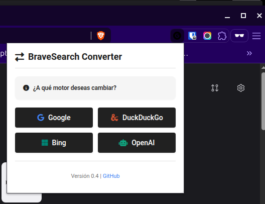

<div align="center">

# Brave Search Converter


### Motores de búsqueda soportados:

[](https://www.google.com) &nbsp;&nbsp;
[](https://www.bing.com) &nbsp;&nbsp;
[](https://duckduckgo.com) &nbsp;&nbsp;
[](https://chat.openai.com) &nbsp;&nbsp;
[](https://www.amazon.es) &nbsp;&nbsp;
[](https://www.youtube.com)

_Convierte tus búsquedas de Brave a Google, DuckDuckGo, Bing, OpenAI, Amazon y YouTube con un solo clic_

[](https://github.com/686f6c61/extension-chrome-brave-to-google-search)
[](https://github.com/686f6c61/extension-chrome-brave-to-google-search)
[](https://github.com/686f6c61/extension-chrome-brave-to-google-search)

</div>

## 📝 Descripción

**Brave Search Converter** es una extensión minimalista para Chrome/Brave que te permite cambiar fácilmente de los resultados de búsqueda de Brave a los resultados equivalentes en Google, DuckDuckGo, Bing, OpenAI, Amazon o YouTube. Con un simple clic, la extensión redirige la página de resultados de Brave Search a la página correspondiente del motor de búsqueda seleccionado, conservando exactamente los mismos términos de búsqueda.

## ✨ Características

- 🔄 Conversión instantánea de Brave Search a múltiples motores de búsqueda
- 🔍 Mantiene los términos de búsqueda originales
- 🔎 Soporte para Google, DuckDuckGo, Bing, OpenAI, Amazon y YouTube
- 🎨 Interfaz minimalista con colores distintivos para cada motor de búsqueda
- 📱 Diseño moderno y responsive
- 🔔 Feedback visual con indicadores de estado
- ⚡ Ligera y rápida, sin impacto en el rendimiento
- ⚙️ Panel de configuración personalizable para dominios regionales
- 💻 Posibilidad de cambiar el orden de los botones mediante arrastrar y soltar
- 💾 Guarda tus preferencias automáticamente entre sesiones

## 🖼️ Capturas de pantalla



- Panel principal con el título "Brave Search Converter"
- Indicador de estado que muestra si estás en una página de Brave Search
- Botones para convertir la búsqueda a Google, DuckDuckGo, Bing, OpenAI, Amazon y YouTube
- Panel de configuración para personalizar dominios regionales y orden de botones
- Información de versión y enlace al repositorio

## 🚀 Instalación

### Método 1: Instalación desde Chrome Web Store (Próximamente)

_La extensión estará disponible en Chrome Web Store._

### Método 2: Instalación manual (Modo desarrollador)

1. Descarga o clona este repositorio
   ```bash
   git clone https://github.com/686f6c61/extension-chrome-brave-to-google-search.git
   ```

2. Abre Chrome/Brave y navega a `chrome://extensions/`

3. Activa el "Modo de desarrollador" en la esquina superior derecha

4. Haz clic en "Cargar descomprimida" y selecciona la carpeta que contiene los archivos de la extensión

5. ¡Listo! La extensión aparecerá en tu barra de herramientas

## 🔧 Uso

1. Navega a una página de resultados de búsqueda de Brave (URL que comience con `https://search.brave.com/search?`)

2. Haz clic en el icono de la extensión en la barra de herramientas

3. Verás un mensaje preguntando a qué motor de búsqueda deseas cambiar

4. Si estás en una página de búsqueda de Brave, selecciona uno de los motores disponibles:
   - Google: Para buscar en Google Search
   - DuckDuckGo: Para buscar en DuckDuckGo
   - Bing: Para buscar en Microsoft Bing
   - OpenAI: Para preguntar a ChatGPT
   - Amazon: Para buscar productos en Amazon
   - YouTube: Para buscar videos en YouTube

5. La página se actualizará automáticamente con los resultados equivalentes en el motor seleccionado

6. Para personalizar la extensión:
   - Haz clic en el botón "Configuración"
   - Selecciona los dominios regionales para Amazon y YouTube
   - Arrastra y suelta los botones para cambiar su orden
   - Haz clic en "Guardar" para aplicar los cambios

## ⚠️ Limitaciones

- La extensión solo funciona en páginas de resultados de búsqueda de Brave
- Requiere una conexión a internet activa para redirigir a los motores de búsqueda
- Para OpenAI, es posible que necesites estar logueado o tener una cuenta para acceder a ChatGPT
- No recopila ni almacena datos de búsqueda

## 👥 Contribuciones

Las contribuciones son bienvenidas. Si deseas mejorar esta extensión:

1. Haz un fork del repositorio
2. Crea una rama para tu característica (`git checkout -b feature/nueva-caracteristica`)
3. Haz commit de tus cambios (`git commit -m 'Añade nueva característica'`)
4. Haz push a la rama (`git push origin feature/nueva-caracteristica`)
5. Abre un Pull Request

## 📄 Licencia

Distribuido bajo la Licencia MIT. Ver `LICENSE` para más información.

## 📧 Contacto

Puedes encontrarme en GitHub: [@686f6c61](https://github.com/686f6c61)

---

<div align="center">

_Desarrollado con ❤️ para la comunidad_

</div>
